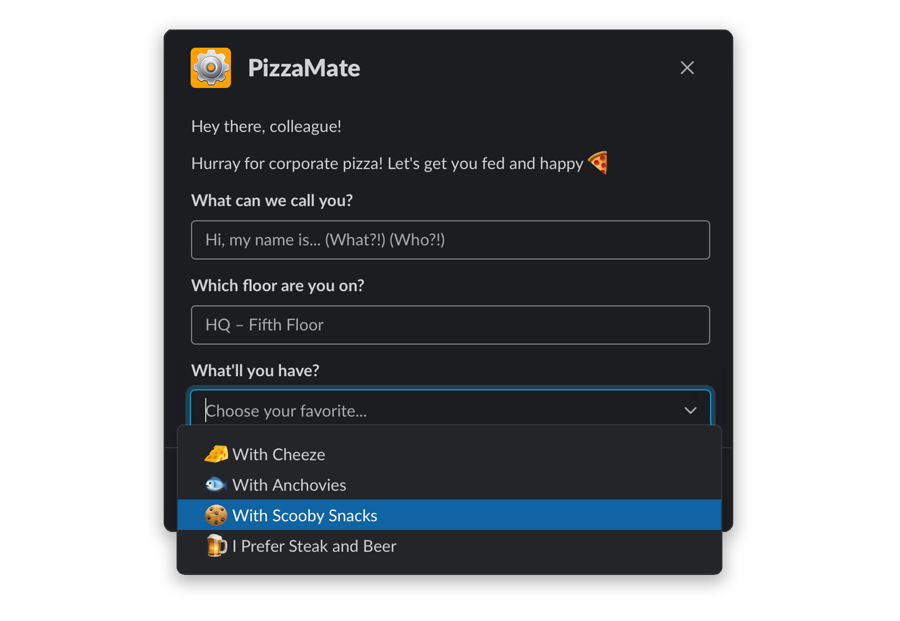

<p align="center">
    
</p>

<p align="center">
    <h3 align="center">Maintainable code for Slack interactive messages, modals, and home tabs.</h3>
</p>

<p align="center">
    Lightweight, zero-dependency JavaScript library for <strong>Slack Block Kit UI</strong>.
    <br />
    <br />
    <a href="https://blockbuilder.dev" target="_blank"><strong>View the Docs »</strong></a>
    <br />
    <br />
    <a href="#space_invader--usage">Quick Start Guide</a>
    ·
    <a href="https://github.com/raycharius/slack-block-builder/issues">Request Feature</a>
    ·
    <a href="https://github.com/raycharius/slack-block-builder/issues">Report Bug</a>
  </p>
</p>


***

[](https://www.npmjs.com/package/slack-block-builder)

[](https://codecov.io/gh/raycharius/slack-block-builder)
[](https://codeclimate.com/github/raycharius/slack-block-builder/maintainability)

**Block Builder** helps you keep your Slack app code for UI maintainable, testable, and reusable. It has a simple builder syntax inspired by [SwiftUI](https://developer.apple.com/documentation/swiftui) and lets you code the way _you_ want to code.

### :zap: &nbsp; Features

* Simple [SwiftUI](https://developer.apple.com/xcode/swiftui/) inspired syntax.
* In-depth [doc site](https://blockbuilder.dev) at [https://blockbuilder.dev](https://blockbuilder.dev).
* Support for all current Slack Block Kit objects – Surfaces, Blocks, Elements, and Composition Objects ([View Support](#object-support-and-reference)).
* Super helpful JSDoc hints that include real-world explanations, Slack validation rules, and a direct link to the object's documentation on [Slack's API doc site](https://api.slack.com/block-kit).
* Output of the composed UI as either an object, JSON string, or array of blocks.
* A `printPreviewURL()` method that outputs to the console a link to preview your UI on Slack's [Block Kit Builder website](https://app.slack.com/block-kit-builder).
* Small size, with zero dependencies.

### :rocket: &nbsp; Coming Soon

* TypeScript type definitions.
* Components, such as an Accordion module.
* Configurable option to check [Slack](https://slack.com) validation rules.
* Guide for [Slack](https://slack.com) apps with tips, tricks, and best practices.


### :gift: &nbsp; Benefits

* Write three times less code.
* Build more sophistocated, elegant flows.
* Design better UI architecture (works as a template engine).
* Focus more on experience and code in your IDE than on reading [Slack API docs](https://api.slack.com/).
* Code the way you want to code – [not forced into any single paradigm](#advanced-use-cases).
* Easily integrate localizations into your app.

### :phone: Let's Talk?

Feedback – love it! Aside from GitHub Issues, there are Slack channels available in popular bot communities to discuss **Block Builder** – we'll see you there! :raised_hands:

* **Slack Community** – [\#block-builder](https://slackcommunity.com)
* **Bot Developer Hangout** – [\#block-builder](https://community.botkit.ai)

### :floppy_disk: &nbsp; Installation 

#### Using NPM: 

``` bash
npm install --save slack-block-builder
```

#### Using Yarn: 

``` bash
yarn add slack-block-builder
```

### :space_invader: &nbsp; Usage

For full documentation, make sure you head over to [https://blockbuilder.dev](https://blockbuilder.dev).


### Importing

At the top level of the library, there are a few objects exposed for import. You'll be using these to build out your UI: 

```javascript
import { Message, Blocks, Elements, Bits } from 'slack-block-builder';
```

You can also import, in place of `Message`, `Modal` or `HomeTab`.

### Exposed Imports

`Modal` – Used to create a modal surface.

`Message` – Used to create a message surface.

`HomeTab` – Used to create a message surface.

_Note that since you'll more often only be working with one surface per file, they are exposed individually, whereas the rest of the objects are grouped into categories._

`Blocks` – Layout blocks used to organize the UI.

`Elements` – UI elements that are used to capture user interaction.

`Bits` – These are composition objects and other bits and pieces from Slack's docs. Included are `Attachment`, `Options`, `OptionGroup`, and `ConfirmationDialog`. They felt like they were deserving of their own category.

### Object Support and Reference

Below is a list of supported objects and how to access them in **Block Builder**:

| **Name**             | **Type**           | **Support**                    | **Accessed Via**                      
|----------------------|--------------------|--------------------------------|-----------------------------
| Home Tab             | Surface            | :white_check_mark:             | `HomeTab()`                       
| Message              | Surface            | :white_check_mark:             | `Message()`                       
| Modal                | Surface            | :white_check_mark:             | `Modal()`                         
| Actions              | Block              | :white_check_mark:             | `Blocks.Actions()`                
| Context              | Block              | :white_check_mark:             | `Blocks.Context()`                
| Divider              | Block              | :white_check_mark:             | `Blocks.Divider()`                
| File                 | Block              | :white_check_mark:             | `Blocks.File()`
| Header               | Block              | :white_check_mark:             | `Blocks.Header()`
| Image                | Block              | :white_check_mark:             | `Blocks.Image()`                  
| Input                | Block              | :white_check_mark:             | `Blocks.Input()`                  
| Section              | Block              | :white_check_mark:             | `Blocks.Section()`                
| Button               | Element            | :white_check_mark:️             | `Elements.Button()`               
| Checkboxes           | Element            | :white_check_mark:             | `Elements.Checkboxes()`           
| Date Picker          | Element            | :white_check_mark:             | `Elements.DatePicker()`           
| Image                | Element            | :white_check_mark:             | `Elements.Img()`                  
| Overflow Menu        | Element            | :white_check_mark:             | `Elements.OverflowMenu()`         
| Radio Buttons        | Element            | :white_check_mark:             | `Elements.RadioButtons()`         
| Plain-Text Input     | Element            | :white_check_mark:             | `Elements.TextInput()`            
| Select Menus         | Element            | :white_check_mark:             | `Elements.[Type]Select()`          
| Multi-Select Menus   | Element            | :white_check_mark:             | `Elements.[Type]MultiSelect()`     
| Option               | Composition Object | :white_check_mark:             | `Bits.Option()`                   
| Confirm Dialog       | Composition Object | :white_check_mark:             | `Bits.ConfirmationDialog()`       
| Option Group         | Composition Object | :white_check_mark:             | `Bits.OptionGroup()`
| Attachment           | Legacy Feature     | :white_check_mark:             | `Bits.Attachment()`              

### Creating a Simple Interactive Message

Let's take a look at how to compose an interactive message. Even though [Slack](https://slack.com) now has modals, these have always been the basis for [Slack](https://slack.com) apps.

We can create a piece of UI using only the setter methods: 

```javascript
import { Message, Blocks, Elements } from 'slack-block-builder';

const myMessage = ({ channel }) => {
  return Message()
    .channel(channel)
    .text('Alas, my friend.')
    .blocks(
      Blocks.Section()
        .text('One does not simply walk into Slack and click a button.'),
      Blocks.Section()
        .text('At least that\'s what my friend Slackomir said :crossed_swords:'),
      Blocks.Divider(),
      Blocks.Actions()
        .elements(
          Elements.Button()
            .text('Sure One Does')
            .actionId('gotClicked')
            .danger(),
          Elements.Button()
            .text('One Does Not')
            .actionId('scaredyCat')
            .primary()))
    .asUser()
    .buildToJSON();
};
```
Alternatively (and preferably), we can combine both the setter methods and the params to shorten it:

```javascript
import { Message, Blocks, Elements } from 'slack-block-builder';

const myShorterMessage = ({ channel }) => {
  return Message({ channel, text: 'Alas, my friend.' })
    .blocks(
      Blocks.Section({ text: 'One does not simply walk into Slack and click a button.' }),
      Blocks.Section({ text: 'At least that\'s what my friend Slackomir said :crossed_swords:' }),
      Blocks.Divider(),
      Blocks.Actions()
        .elements(
          Elements.Button({ text: 'Sure One Does', actionId: 'gotClicked' })
            .danger(),
          Elements.Button({ text: 'One Does Not', actionId: 'scaredyCat' })
            .primary()))
    .asUser()
    .buildToJSON();
};
```

Both of these examples render the message below. And the best part? It only took 15 lines of code, as opposed to the 44 lines of JSON generated as a result. 


[**View Example on Slack Block Kit Builder Website**](https://app.slack.com/block-kit-builder#%7B%22blocks%22:%5B%7B%22type%22:%22section%22,%22text%22:%7B%22type%22:%22mrkdwn%22,%22text%22:%22One%20does%20not%20simply%20walk%20into%20Slack%20and%20click%20a%20button.%22%7D%7D,%7B%22type%22:%22section%22,%22text%22:%7B%22type%22:%22mrkdwn%22,%22text%22:%22At%20least%20that's%20what%20my%20friend%20Slackomir%20said%20:crossed_swords:%22%7D%7D,%7B%22type%22:%22divider%22%7D,%7B%22type%22:%22actions%22,%22elements%22:%5B%7B%22type%22:%22button%22,%22text%22:%7B%22type%22:%22plain_text%22,%22text%22:%22Sure%20One%20Does%22%7D,%22action_id%22:%22gotClicked%22,%22style%22:%22danger%22%7D,%7B%22type%22:%22button%22,%22text%22:%7B%22type%22:%22plain_text%22,%22text%22:%22One%20Does%20Not%22%7D,%22action_id%22:%22scaredyCat%22,%22style%22:%22primary%22%7D%5D%7D%5D%7D)

### Creating a Simple Modal

Let's take a look at how modals are created. 

Here we'll also take a look at working with Bits. You'll see in this example that we're hardcoding the options in the select menu. There are, of course, better ways to handle that, by using the `Array.map()` method, but they are listed here separately to demonstrate the usage.

First, an example using just our setter methods:

```javascript
import { Modal, Blocks, Elements, Bits } from 'slack-block-builder';

const myModal = () => {
  return Modal()
    .title('PizzaMate')
    .blocks(
      Blocks.Section()
        .text('Hey there, colleague!'),
      Blocks.Section()
        .text('Hurray for corporate pizza! Let\'s get you fed and happy :pizza:'),
      Blocks.Input()
        .label('What can we call you?')
        .element(
          Elements.TextInput()
            .placeholder('Hi, my name is... (What?!) (Who?!)')
            .actionId('name')),
      Blocks.Input()
        .label('Which floor are you on?')
        .element(
          Elements.TextInput()
            .placeholder('HQ – Fifth Floor')
            .actionId('floor')),
      Blocks.Input()
        .label('What\'ll you have?')
        .element(
          Elements.StaticSelect()
            .placeholder('Choose your favorite...')
            .actionId('item')
            .options(
              Bits.Option().text(':cheese_wedge: With Cheeze').value('012'),
              Bits.Option().text(':fish: With Anchovies').value('013'),
              Bits.Option().text(':cookie: With Scooby Snacks').value('014'),
              Bits.Option().text(':beer: I Prefer Steak and Beer').value('015'))))
    .submit('Get Fed')
    .buildToJSON();
};
```

Alternatively (and preferably), we can combine both the setter methods and the params to shorten it:

```javascript
import { Modal, Blocks, Elements, Bits } from 'slack-block-builder';

const myShorterModal = () => {
  return Modal({ title: 'PizzaMate', submit: 'Get Fed' })
    .blocks(
      Blocks.Section({ text: 'Hey there, colleague!' }),
      Blocks.Section({ text: 'Hurray for corporate pizza! Let\'s get you fed and happy :pizza:' }),
      Blocks.Input({ label: 'What can we call you?' })
        .element(
          Elements.TextInput({ placeholder: 'Hi, my name is... (What?!) (Who?!)' })
            .actionId('name')),
      Blocks.Input({ label: 'Which floor are you on?' })
        .element(
          Elements.TextInput({ placeholder: 'HQ – Fifth Floor' })
            .actionId('floor')),
      Blocks.Input({ label: 'What\'ll you have?' })
        .element(
          Elements.StaticSelect({ placeholder: 'Choose your favorite...' })
            .actionId('item')
            .options(
              Bits.Option({ text: ':cheese_wedge: With Cheeze', value: '012' }),
              Bits.Option({ text: ':fish: With Anchovies', value: '013' }),
              Bits.Option({ text: ':cookie: With Scooby Snacks', value: '014' }),
              Bits.Option({ text: ':beer: I Prefer Steak and Beer', value: '015' }))))
    .buildToJSON();
};
```

Both of these examples render the modal below. 



[**View Example on Slack Block Kit Builder Website**](https://app.slack.com/block-kit-builder#%7B%22type%22:%22modal%22,%22title%22:%7B%22type%22:%22plain_text%22,%22text%22:%22PizzaMate%22%7D,%22blocks%22:%5B%7B%22type%22:%22section%22,%22text%22:%7B%22type%22:%22mrkdwn%22,%22text%22:%22Hey%20there,%20colleague!%22%7D%7D,%7B%22type%22:%22section%22,%22text%22:%7B%22type%22:%22mrkdwn%22,%22text%22:%22Hurray%20for%20corporate%20pizza!%20Let's%20get%20you%20fed%20and%20happy%20:pizza:%22%7D%7D,%7B%22type%22:%22input%22,%22label%22:%7B%22type%22:%22plain_text%22,%22text%22:%22What%20can%20we%20call%20you?%22%7D,%22element%22:%7B%22type%22:%22plain_text_input%22,%22action_id%22:%22name%22,%22placeholder%22:%7B%22type%22:%22plain_text%22,%22text%22:%22Hi,%20my%20name%20is...%20(What?!)%20(Who?!)%22%7D%7D%7D,%7B%22type%22:%22input%22,%22label%22:%7B%22type%22:%22plain_text%22,%22text%22:%22Which%20floor%20are%20you%20on?%22%7D,%22element%22:%7B%22type%22:%22plain_text_input%22,%22action_id%22:%22floor%22,%22placeholder%22:%7B%22type%22:%22plain_text%22,%22text%22:%22HQ%20–%20Fifth%20Floor%22%7D%7D%7D,%7B%22type%22:%22input%22,%22label%22:%7B%22type%22:%22plain_text%22,%22text%22:%22What'll%20you%20have?%22%7D,%22element%22:%7B%22type%22:%22static_select%22,%22placeholder%22:%7B%22type%22:%22plain_text%22,%22text%22:%22Choose%20your%20favorite...%22%7D,%22action_id%22:%22item%22,%22options%22:%5B%7B%22text%22:%7B%22type%22:%22plain_text%22,%22text%22:%22:cheese_wedge:%20With%20Cheeze%22%7D,%22value%22:%22012%22%7D,%7B%22text%22:%7B%22type%22:%22plain_text%22,%22text%22:%22:fish:%20With%20Anchovies%22%7D,%22value%22:%22013%22%7D,%7B%22text%22:%7B%22type%22:%22plain_text%22,%22text%22:%22:cookie:%20With%20Scooby%20Snacks%22%7D,%22value%22:%22014%22%7D,%7B%22text%22:%7B%22type%22:%22plain_text%22,%22text%22:%22:beer:%20I%20Prefer%20Steak%20and%20Beer%22%7D,%22value%22:%22015%22%7D%5D%7D%7D%5D,%22submit%22:%7B%22type%22:%22plain_text%22,%22text%22:%22Get%20Fed%22%7D%7D)

## :link: &nbsp; Other Useful Slack-Related Projects

[Bolt for JavaScript](https://github.com/SlackAPI/bolt) – A simple framework for building [Slack](https://slack.com) apps, developed by [Slack](https://slack.com) themselves.

[Node Slack SDK](https://github.com/slackapi/node-slack-sdk) – A great and powerful SDK for building [Slack](https://slack.com) Apps from the ground up.

[JSX-Slack](https://github.com/speee/jsx-slack) – Awesome way to create Slack Block Kit UIs using JSX.

## :fire: &nbsp; Acknowledgements
 
 Taras Neporozhniy ([@bravecow](https://github.com/bravecow)) - For mentorship over the years!

 Alexey Chernyshov ([@ft502](https://dribbble.com/ft502) on Dribbble) - For such a beautiful logo!

 SlackHQ ([@slackhq](https://github.com/slackhq)) - For such a wonderful product and API!

## :black_nib: &nbsp; Author

 Ray East ([@raycharius](https://github.com/raycharius)) - Huge Fan of Slack and **Block Builder** Maintainer
