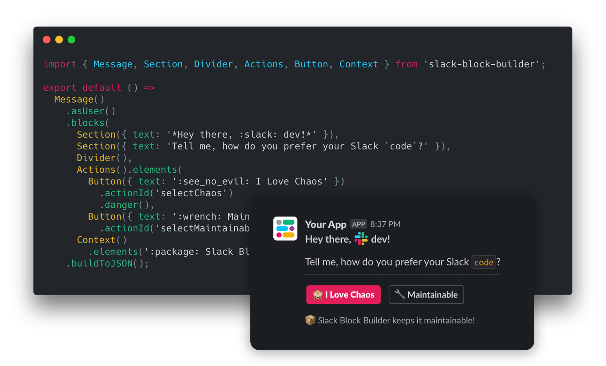
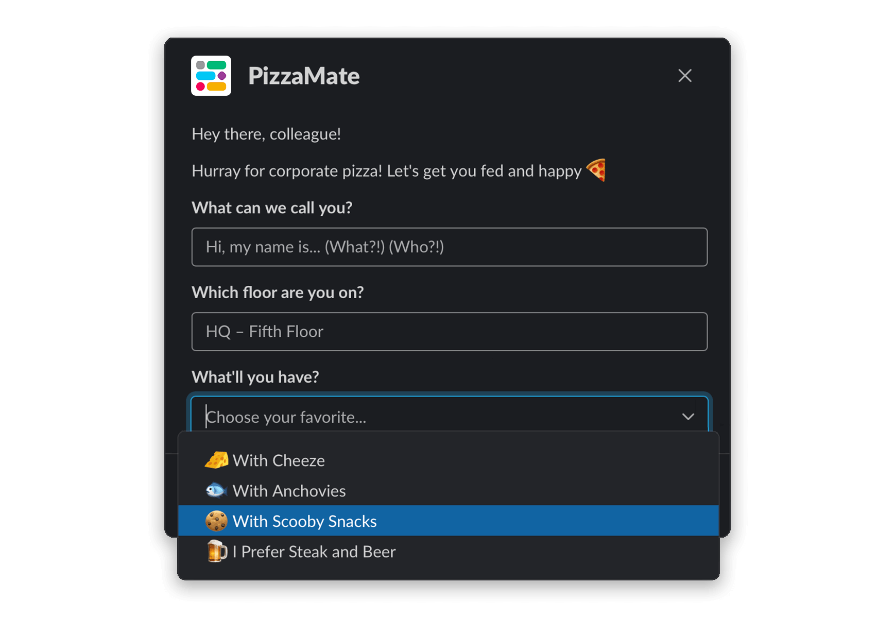
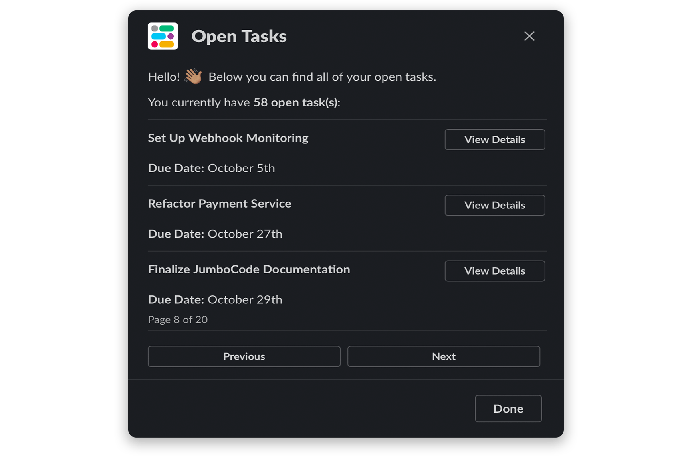
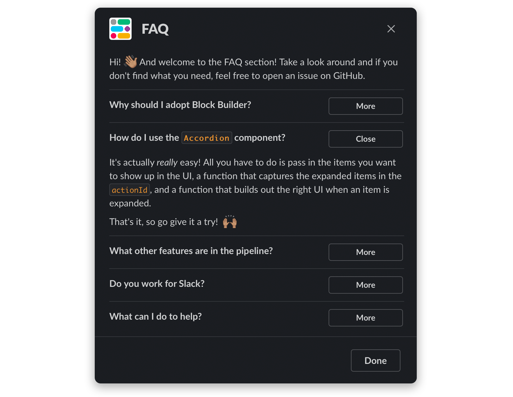

:information_source: **Block Builder** was built in Kyiv, Ukraine :ukraine: If it has saved you time as a developer and brought value to your projects and products, we would like to ask you to consider donating to **[Come Back Alive](https://savelife.in.ua/en/donate/)** to help Ukraine in its fight against Russian aggression. Every cent helps. :pray:

***      

<p align="center">
    
</p>

<p align="center">
    <h3 align="center">Maintainable code for Slack interactive messages, modals, and home tabs.</h3>
</p>

<p align="center">
    Lightweight, zero-dependency library for declaratively building Slack Block Kit UI.
    <br />
    <br />
    <a href="https://blockbuilder.dev" target="_blank"><strong>View the Docs »</strong></a>
    <br />
    <br />
    <a href="#space_invader--usage">Quick Start Guide</a>
    ·
    <a href="https://github.com/raycharius/slack-block-builder/issues">Request Feature</a>
    ·
    <a href="https://github.com/raycharius/slack-block-builder/issues">Report Bug</a>
  </p>
</p>



***

[](https://www.npmjs.com/package/slack-block-builder)

[](https://codecov.io/gh/raycharius/slack-block-builder)

**Block Builder** helps you keep your Slack app code for UI maintainable, testable, and reusable. It has a declarative, chainable syntax inspired by [SwiftUI](https://developer.apple.com/documentation/swiftui) and is built for better UI architecture.

### :zap: &nbsp; Features

* Declarative [SwiftUI](https://developer.apple.com/xcode/swiftui/) inspired syntax.
* Commonly-used UI components, such as a `Paginator` and `Accordion`.
* Inline conditional helper functions for declaratively appending or omitting UI content.
* The ability to build more complex flows using loops and conditionals.
* A `printPreviewURL()` method that outputs a link to preview your UI on Slack's [Block Kit Builder website](https://app.slack.com/block-kit-builder) for easier prototyping.
* A set of helper functions for formatting text with Slack's markdown standard.
* In-depth [doc site](https://blockbuilder.dev) at [https://blockbuilder.dev](https://blockbuilder.dev).
* [Support](#block-kit-support-and-reference) for all current Slack Block Kit objects.
* A great TypeScript experience.
* Extensive JSDoc hints with explanations, validation rules, and quick links to full documentation.
* Zero dependencies.

### :gift: &nbsp; Benefits

* Write three times less code.
* Build more sophisticated, elegant flows.
* Design better UI architecture for your Slack apps.
* Focus more on code in your IDE than on studying the [Slack API docs](https://api.slack.com/).
* Easily integrate localizations into your app.

### :busts_in_silhouette: &nbsp; Join The Community

Feedback – love it! Aside from GitHub Issues, there's a Slack channel available in the Slack Community workspace to discuss **Block Builder** – we'll see you there! :raised_hands:

* **Slack Community** – [\#block-builder](https://slackcommunity.com)

### :floppy_disk: &nbsp; Installation 

**Block Builder** requires Node.js 12 or higher, and, when using TypeScript, TypeScript 3.8 or higher.

#### Using NPM: 

``` bash
npm install --save slack-block-builder
```

#### Using Yarn: 

``` bash
yarn add slack-block-builder
```

### :space_invader: &nbsp; Usage

For full documentation, make sure you head over to [https://blockbuilder.dev](https://blockbuilder.dev).


### Importing

The functions for creating objects can be both imported directly or through an object that groups them by category.

```javascript
// Importing exposed groups of objects

import { Surfaces, Blocks, Elements, Bits, Utilities } from 'slack-block-builder';

// Importing objects top-level

import { Modal, Section, Actions, Button } from 'slack-block-builder';
```

The same goes for importing Slack markdown helper functions:

```javascript
// Importing the Md object

import { Surfaces, Blocks, Md } from 'slack-block-builder';

// Importing the functions top-level

import { Modal, Section, bold, link } from 'slack-block-builder';
```

### Object Breakdown

`Surfaces` – Contains functions for creating modals, messages, home tabs, and workflow steps. 

`Blocks` – Layout blocks used to organize the UI.

`Elements` – UI elements that are used to capture user interaction.

`Bits` – These are composition objects and other bits and pieces from Slack's docs. Included are `Attachment`, `Options`, `OptionGroup`, and `ConfirmationDialog`. They felt like they were deserving of their own category.

`Utilities` – A group of utility functions. See [Utility Functions](#utility-functions).

`Md` – Helper functions for formatting text with Slack's markdown. See [Markdown Helpers](#markdown-helpers).

### Block Kit Support and Reference

Below is a list of supported objects and how to access them in **Block Builder**:

| **Name**           | **Type**           | **Support**                    | **Accessed Via**                      
|--------------------|--------------------|--------------------------------|-----------------------------------------
| Home Tab           | Surface            | :white_check_mark:             | `Surfaces.HomeTab()`                       
| Message            | Surface            | :white_check_mark:             | `Surfaces.Message()`                       
| Modal              | Surface            | :white_check_mark:             | `Surfaces.Modal()`                         
| Workflow Step      | Surface            | :white_check_mark:             | `Surfaces.WorkflowStep()`                         
| Actions            | Block              | :white_check_mark:             | `Blocks.Actions()`                
| Context            | Block              | :white_check_mark:             | `Blocks.Context()`                
| Divider            | Block              | :white_check_mark:             | `Blocks.Divider()`                
| File               | Block              | :white_check_mark:             | `Blocks.File()`
| Header             | Block              | :white_check_mark:             | `Blocks.Header()`
| Image              | Block              | :white_check_mark:             | `Blocks.Image()`                  
| Input              | Block              | :white_check_mark:             | `Blocks.Input()`                  
| Section            | Block              | :white_check_mark:             | `Blocks.Section()`
| Video              | Block              | :white_check_mark:             | `Blocks.Video()`                
| Button             | Element            | :white_check_mark:️             | `Elements.Button()`               
| Checkboxes         | Element            | :white_check_mark:             | `Elements.Checkboxes()`           
| Date Picker        | Element            | :white_check_mark:             | `Elements.DatePicker()`
| Date Time Picker   | Element            | :white_check_mark:             | `Elements.DateTimePicker()`
| Email Input        | Element            | :white_check_mark:             | `Elements.EmailInput()`
| Time Picker        | Element            | :white_check_mark:             | `Elements.TimePicker()`           
| Image              | Element            | :white_check_mark:             | `Elements.Img()`       
| Number Input       | Element            | :white_check_mark:             | `Elements.NumberInput()`
| Overflow Menu      | Element            | :white_check_mark:             | `Elements.OverflowMenu()`         
| Radio Buttons      | Element            | :white_check_mark:             | `Elements.RadioButtons()`         
| Plain-Text Input   | Element            | :white_check_mark:             | `Elements.TextInput()`            
| Select Menus       | Element            | :white_check_mark:             | `Elements.[Type]Select()`          
| Multi-Select Menus | Element            | :white_check_mark:             | `Elements.[Type]MultiSelect()`
| URL Input          | Element            | :white_check_mark:             | `Elements.NumberInput()`
| Option             | Composition Object | :white_check_mark:             | `Bits.Option()`                   
| Confirm Dialog     | Composition Object | :white_check_mark:             | `Bits.ConfirmationDialog()`       
| Option Group       | Composition Object | :white_check_mark:             | `Bits.OptionGroup()`
| Attachment         | Legacy Feature     | :white_check_mark:             | `Bits.Attachment()`              

### Creating a Simple Interactive Message

Let's take a look at how to compose an interactive message. Even though [Slack](https://slack.com) now has modals, these have always been the basis for [Slack](https://slack.com) apps.

Functions that return Block Kit objects have setter methods for all of the properties, but also support parameters that are passed into the constructor for properties with primitive types.

```javascript
import { Message, Blocks, Elements } from 'slack-block-builder';

export default ({ channel, dangerLevel }) =>
  Message()
    .channel(channel)
    .text('Alas, my friend.')
    .blocks(
      Blocks.Section()
        .text('One does not simply walk into Slack and click a button.'),
      Blocks.Section()
        .text('At least that\'s what my friend Slackomir said :crossed_swords:'),
      Blocks.Divider(),
      Blocks.Actions()
        .elements(
          Elements.Button()
            .text('Sure One Does')
            .actionId('gotClicked')
            .danger(dangerLevel > 42), // Optional argument, defaults to 'true'
          Elements.Button()
            .text('One Does Not')
            .actionId('scaredyCat')
            .primary()))
    .asUser()
    .buildToJSON();
```

And now an example with using both the setter methods and passing parameters into the functions at initiation:

```javascript
import { Message, Blocks, Elements } from 'slack-block-builder';

export default ({ channel, dangerLevel }) =>
  Message({ channel, text: 'Alas, my friend.' })
    .blocks(
      Blocks.Section({ text: 'One does not simply walk into Slack and click a button.' }),
      Blocks.Section({ text: 'At least that\'s what my friend Slackomir said :crossed_swords:' }),
      Blocks.Divider(),
      Blocks.Actions()
        .elements(
          Elements.Button({ text: 'Sure One Does', actionId: 'gotClicked' })
            .danger(dangerLevel > 42), // Optional argument, defaults to 'true'
          Elements.Button({ text: 'One Does Not', actionId: 'scaredyCat' })
            .primary()))
    .asUser()
    .buildToJSON();
```

Both of these examples render the message below. And the best part? It only took 15 lines of code, as opposed to the 44 lines of JSON generated as a result. 


[**View Example on Slack Block Kit Builder Website**](https://app.slack.com/block-kit-builder#%7B%22blocks%22:%5B%7B%22type%22:%22section%22,%22text%22:%7B%22type%22:%22mrkdwn%22,%22text%22:%22One%20does%20not%20simply%20walk%20into%20Slack%20and%20click%20a%20button.%22%7D%7D,%7B%22type%22:%22section%22,%22text%22:%7B%22type%22:%22mrkdwn%22,%22text%22:%22At%20least%20that's%20what%20my%20friend%20Slackomir%20said%20:crossed_swords:%22%7D%7D,%7B%22type%22:%22divider%22%7D,%7B%22type%22:%22actions%22,%22elements%22:%5B%7B%22type%22:%22button%22,%22text%22:%7B%22type%22:%22plain_text%22,%22text%22:%22Sure%20One%20Does%22%7D,%22action_id%22:%22gotClicked%22,%22style%22:%22danger%22%7D,%7B%22type%22:%22button%22,%22text%22:%7B%22type%22:%22plain_text%22,%22text%22:%22One%20Does%20Not%22%7D,%22action_id%22:%22scaredyCat%22,%22style%22:%22primary%22%7D%5D%7D%5D%7D)

### Creating a Simple Modal

Let's take a look at how modals are created. Here we'll also take a look at working with Bits and with loops, by adding options with the `Array.map()` method. 

```javascript
import { Modal, Blocks, Elements, Bits, setIfTruthy } from 'slack-block-builder';

export default ({ menuOptions, selected }) =>
  Modal({ title: 'PizzaMate', submit: 'Get Fed' })
    .blocks(
      Blocks.Section({ text: 'Hey there, colleague!' }),
      Blocks.Section({ text: 'Hurray for corporate pizza! Let\'s get you fed and happy :pizza:' }),
      Blocks.Input({ label: 'What can we call you?' })
        .element(
          Elements.TextInput({ placeholder: 'Hi, my name is... (What?!) (Who?!)' })
            .actionId('name')),
      Blocks.Input({ label: 'Which floor are you on?' })
        .element(
          Elements.TextInput({ placeholder: 'HQ – Fifth Floor' })
            .actionId('floor')),
      Blocks.Input({ label: 'What\'ll you have?' })
        .element(
          Elements.StaticSelect({ placeholder: 'Choose your favorite...' })
            .actionId('item')
            .options(menuOptions
              .map((item) => Bits.Option({ text: item.name, value: item.id })))
            .initialOption(setIfTruthy(selected, Bits.Option({ text: selected.name, value: selected.id })))))
    .buildToJSON();
```

Both of these examples render the modal below. 



[**View Example on Slack Block Kit Builder Website**](https://app.slack.com/block-kit-builder#%7B%22type%22:%22modal%22,%22title%22:%7B%22type%22:%22plain_text%22,%22text%22:%22PizzaMate%22%7D,%22blocks%22:%5B%7B%22type%22:%22section%22,%22text%22:%7B%22type%22:%22mrkdwn%22,%22text%22:%22Hey%20there,%20colleague!%22%7D%7D,%7B%22type%22:%22section%22,%22text%22:%7B%22type%22:%22mrkdwn%22,%22text%22:%22Hurray%20for%20corporate%20pizza!%20Let's%20get%20you%20fed%20and%20happy%20:pizza:%22%7D%7D,%7B%22type%22:%22input%22,%22label%22:%7B%22type%22:%22plain_text%22,%22text%22:%22What%20can%20we%20call%20you?%22%7D,%22element%22:%7B%22type%22:%22plain_text_input%22,%22action_id%22:%22name%22,%22placeholder%22:%7B%22type%22:%22plain_text%22,%22text%22:%22Hi,%20my%20name%20is...%20(What?!)%20(Who?!)%22%7D%7D%7D,%7B%22type%22:%22input%22,%22label%22:%7B%22type%22:%22plain_text%22,%22text%22:%22Which%20floor%20are%20you%20on?%22%7D,%22element%22:%7B%22type%22:%22plain_text_input%22,%22action_id%22:%22floor%22,%22placeholder%22:%7B%22type%22:%22plain_text%22,%22text%22:%22HQ%20–%20Fifth%20Floor%22%7D%7D%7D,%7B%22type%22:%22input%22,%22label%22:%7B%22type%22:%22plain_text%22,%22text%22:%22What'll%20you%20have?%22%7D,%22element%22:%7B%22type%22:%22static_select%22,%22placeholder%22:%7B%22type%22:%22plain_text%22,%22text%22:%22Choose%20your%20favorite...%22%7D,%22action_id%22:%22item%22,%22options%22:%5B%7B%22text%22:%7B%22type%22:%22plain_text%22,%22text%22:%22:cheese_wedge:%20With%20Cheeze%22%7D,%22value%22:%22012%22%7D,%7B%22text%22:%7B%22type%22:%22plain_text%22,%22text%22:%22:fish:%20With%20Anchovies%22%7D,%22value%22:%22013%22%7D,%7B%22text%22:%7B%22type%22:%22plain_text%22,%22text%22:%22:cookie:%20With%20Scooby%20Snacks%22%7D,%22value%22:%22014%22%7D,%7B%22text%22:%7B%22type%22:%22plain_text%22,%22text%22:%22:beer:%20I%20Prefer%20Steak%20and%20Beer%22%7D,%22value%22:%22015%22%7D%5D%7D%7D%5D,%22submit%22:%7B%22type%22:%22plain_text%22,%22text%22:%22Get%20Fed%22%7D%7D)

### Paginator Component

**Block Builder** provides a `Paginator` component that assists in producing paginated UI. It allows you to dictate the UI to build for each items passed in and provides to the `actionId` all of the data (`page`, `perPage`, `totalPages`, `offset`, `totalItems` ) you need to produce the right page when a user clicks the Next or Previous buttons.

Note that there is a [demo app available](https://github.com/raycharius/slack-block-builder-demo) that demonstrates how to use components.  

The `Paginator` component supports optional customizations, such as:  

`nextButtonText` – Used to pass in custom text for the Next button, but has a default.

`previousButtonText` – Used to pass in custom text for the Next button, but has a default.

`pageCountText` – Used to pass in custom text for the page count, accepts a function and passes the function an object with `page` and `totalPages` properties.

```javascript
import { Modal, Blocks, Elements, Paginator } from 'slack-block-builder';

export default ({ tasks, totalTasks, page, perPage }) => Modal({ title: 'Open Tasks' })
  .blocks(
    Blocks.Section({ text: 'Hi! :wave: And welcome to the FAQ section! Take a look around and if you don\'t find what you need, feel free to open an issue on GitHub.' }),
    Blocks.Section({ text: `You currently have *${totalTasks} open task(s)*:` }),
    Paginator({
      perPage,
      items: tasks,
      totalItems: totalTasks,
      page: page || 1,
      actionId: ({ page, offset }) => JSON.stringify({ action: 'render-tasks', page, offset }),
      blocksForEach: ({ item }) => [
        Blocks.Divider(),
        Blocks.Section({ text: `*${item.title}*` })
          .accessory(
            Elements.Button({ text: 'View Details' })
              .actionId('view-details')
              .value(item.id.toString())),
        Blocks.Section({ text: `*Due Date:* ${getDate(item.dueDate)}` }),
      ],
    }).getBlocks())
  .close('Done')
  .buildToJSON();
``` 

The code above renders the modal below. And be sure to check out the full documentation on the [**Block Builder** doc site](https://www.blockbuilder.dev/#/components/paginator) for more information.



[**View Example on Slack Block Kit Builder Website**](https://app.slack.com/block-kit-builder/#%7B%22title%22:%7B%22type%22:%22plain_text%22,%22text%22:%22Open%20Tasks%22%7D,%22blocks%22:%5B%7B%22text%22:%7B%22type%22:%22mrkdwn%22,%22text%22:%22Hello!%20:wave::skin-tone-4:%20%20Below%20you%20can%20find%20all%20of%20your%20open%20tasks.%22%7D,%22type%22:%22section%22%7D,%7B%22text%22:%7B%22type%22:%22mrkdwn%22,%22text%22:%22You%20currently%20have%20*58%20open%20task(s)*:%22%7D,%22type%22:%22section%22%7D,%7B%22type%22:%22divider%22%7D,%7B%22text%22:%7B%22type%22:%22mrkdwn%22,%22text%22:%22*Set%20Up%20Webhook%20Monitoring*%22%7D,%22accessory%22:%7B%22text%22:%7B%22type%22:%22plain_text%22,%22text%22:%22View%20Details%22%7D,%22action_id%22:%22view-details%22,%22value%22:%225%22,%22type%22:%22button%22%7D,%22type%22:%22section%22%7D,%7B%22text%22:%7B%22type%22:%22mrkdwn%22,%22text%22:%22*Due%20Date:*%20%3C!date%5E1633392000%5E%7Bdate%7D%7C2021-10-05%3E%22%7D,%22type%22:%22section%22%7D,%7B%22type%22:%22divider%22%7D,%7B%22text%22:%7B%22type%22:%22mrkdwn%22,%22text%22:%22*Refactor%20Payment%20Service*%22%7D,%22accessory%22:%7B%22text%22:%7B%22type%22:%22plain_text%22,%22text%22:%22View%20Details%22%7D,%22action_id%22:%22view-details%22,%22value%22:%223%22,%22type%22:%22button%22%7D,%22type%22:%22section%22%7D,%7B%22text%22:%7B%22type%22:%22mrkdwn%22,%22text%22:%22*Due%20Date:*%20%3C!date%5E1635292800%5E%7Bdate%7D%7C2021-10-27%3E%22%7D,%22type%22:%22section%22%7D,%7B%22type%22:%22divider%22%7D,%7B%22text%22:%7B%22type%22:%22mrkdwn%22,%22text%22:%22*Finalize%20JumboCode%20Documentation*%22%7D,%22accessory%22:%7B%22text%22:%7B%22type%22:%22plain_text%22,%22text%22:%22View%20Details%22%7D,%22action_id%22:%22view-details%22,%22value%22:%224%22,%22type%22:%22button%22%7D,%22type%22:%22section%22%7D,%7B%22text%22:%7B%22type%22:%22mrkdwn%22,%22text%22:%22*Due%20Date:*%20%3C!date%5E1635465600%5E%7Bdate%7D%7C2021-10-29%3E%22%7D,%22type%22:%22section%22%7D,%7B%22elements%22:%5B%7B%22type%22:%22mrkdwn%22,%22text%22:%22Page%208%20of%2020%22%7D%5D,%22type%22:%22context%22%7D,%7B%22type%22:%22divider%22%7D,%7B%22elements%22:%5B%7B%22text%22:%7B%22type%22:%22plain_text%22,%22text%22:%22Previous%22%7D,%22action_id%22:%22%7B%5C%22action%5C%22:%5C%22render-tasks%5C%22,%5C%22page%5C%22:7,%5C%22offset%5C%22:18%7D%22,%22type%22:%22button%22%7D,%7B%22text%22:%7B%22type%22:%22plain_text%22,%22text%22:%22Next%22%7D,%22action_id%22:%22%7B%5C%22action%5C%22:%5C%22render-tasks%5C%22,%5C%22page%5C%22:9,%5C%22offset%5C%22:24%7D%22,%22type%22:%22button%22%7D%5D,%22type%22:%22actions%22%7D%5D,%22close%22:%7B%22type%22:%22plain_text%22,%22text%22:%22Done%22%7D,%22type%22:%22modal%22%7D)

### Accordion Component

Using the `Accordion` component, you can easily create a customizable accordion for your Slack app. It not only assists in building a suitable UI, but also calculates the next state and gives you access to it in the `actionId` of the buttons in the accordion, so that you can pass that back to your app's backend and use it to render the next state.

Note that there is a [demo app available](https://github.com/raycharius/slack-block-builder-demo) that demonstrates how to use components.

The `Accordion` component supports optional customizations, such as: 

`collapseOnExpand` – Dictates whether or not multiple items can be expanded at once. When set to true, only one item will be expanded at any given time.

`expandButtonText` – Used to pass in custom text for the button that expands an item, but has a default.

`collapseButtonText` – Used to pass in custom text for the button that collapses an expanded item, but has a default.
 
```javascript
import { Modal, Blocks, Accordion } from 'slack-block-builder';

export default ({ faqs, expandedItems }) => Modal({ title: 'FAQ' })
  .blocks(
    Blocks.Section({ text: 'Hi! :wave: And welcome to the FAQ section! Take a look around and if you don\'t find what you need, feel free to open an issue on GitHub.'}),
    Blocks.Divider(),
    Accordion({
      items: faqs,
      expandedItems: expandedItems || [], // In this case, the value is [1]
      collapseOnExpand: true,
      titleText: ({ item }) => `*${item.question}*`,
      actionId: ({ expandedItems }) => JSON.stringify({ action: 'render-faqs', expandedItems }),
      blocksForExpanded: ({ item }) => [
       Blocks.Section({ text: `${item.answer}` }),
      ],
    }).getBlocks())
  .close('Done')
  .buildToJSON();
```

The code above renders the modal below. And be sure to check out the full documentation on the [**Block Builder** doc site](https://www.blockbuilder.dev/#/components/accordion) for more information.



[**View Example on Slack Block Kit Builder Website**](https://app.slack.com/block-kit-builder#%7B%22title%22:%7B%22type%22:%22plain_text%22,%22text%22:%22FAQ%22%7D,%22blocks%22:%5B%7B%22text%22:%7B%22type%22:%22mrkdwn%22,%22text%22:%22Hi!%20:wave::skin-tone-4:%20And%20welcome%20to%20the%20FAQ%20section!%20Take%20a%20look%20around%20and%20if%20you%20don't%20find%20what%20you%20need,%20feel%20free%20to%20open%20an%20issue%20on%20GitHub.%22%7D,%22type%22:%22section%22%7D,%7B%22type%22:%22divider%22%7D,%7B%22text%22:%7B%22type%22:%22mrkdwn%22,%22text%22:%22*Why%20should%20I%20adopt%20Block%20Builder?*%22%7D,%22accessory%22:%7B%22text%22:%7B%22type%22:%22plain_text%22,%22text%22:%22More%22%7D,%22action_id%22:%22%7B%5C%22action%5C%22:%5C%22render-faqs%5C%22,%5C%22expandedItems%5C%22:%5B0%5D%7D%22,%22type%22:%22button%22%7D,%22type%22:%22section%22%7D,%7B%22type%22:%22divider%22%7D,%7B%22text%22:%7B%22type%22:%22mrkdwn%22,%22text%22:%22*How%20do%20I%20use%20the%20%60Accordion%60%20component?*%22%7D,%22accessory%22:%7B%22text%22:%7B%22type%22:%22plain_text%22,%22text%22:%22Close%22%7D,%22action_id%22:%22%7B%5C%22action%5C%22:%5C%22render-faqs%5C%22,%5C%22expandedItems%5C%22:%5B%5D%7D%22,%22type%22:%22button%22%7D,%22type%22:%22section%22%7D,%7B%22text%22:%7B%22type%22:%22mrkdwn%22,%22text%22:%22It's%20actually%20_really_%20easy!%20All%20you%20have%20to%20do%20is%20pass%20in%20the%20items%20you%20want%20to%20show%20up%20in%20the%20UI,%20a%20function%20that%20captures%20the%20expanded%20items%20in%20the%20%60actionId%60,%20and%20a%20function%20that%20builds%20out%20the%20right%20UI%20when%20an%20item%20is%20expanded.%5Cn%5CnThat's%20it,%20so%20go%20give%20it%20a%20try!%20%20:raised_hands::skin-tone-4:%22%7D,%22type%22:%22section%22%7D,%7B%22type%22:%22divider%22%7D,%7B%22text%22:%7B%22type%22:%22mrkdwn%22,%22text%22:%22*What%20other%20features%20are%20in%20the%20pipeline?*%22%7D,%22accessory%22:%7B%22text%22:%7B%22type%22:%22plain_text%22,%22text%22:%22More%22%7D,%22action_id%22:%22%7B%5C%22action%5C%22:%5C%22render-faqs%5C%22,%5C%22expandedItems%5C%22:%5B2%5D%7D%22,%22type%22:%22button%22%7D,%22type%22:%22section%22%7D,%7B%22type%22:%22divider%22%7D,%7B%22text%22:%7B%22type%22:%22mrkdwn%22,%22text%22:%22*Do%20you%20work%20for%20Slack?*%22%7D,%22accessory%22:%7B%22text%22:%7B%22type%22:%22plain_text%22,%22text%22:%22More%22%7D,%22action_id%22:%22%7B%5C%22action%5C%22:%5C%22render-faqs%5C%22,%5C%22expandedItems%5C%22:%5B3%5D%7D%22,%22type%22:%22button%22%7D,%22type%22:%22section%22%7D,%7B%22type%22:%22divider%22%7D,%7B%22text%22:%7B%22type%22:%22mrkdwn%22,%22text%22:%22*What%20can%20I%20do%20to%20help?*%22%7D,%22accessory%22:%7B%22text%22:%7B%22type%22:%22plain_text%22,%22text%22:%22More%22%7D,%22action_id%22:%22%7B%5C%22action%5C%22:%5C%22render-faqs%5C%22,%5C%22expandedItems%5C%22:%5B4%5D%7D%22,%22type%22:%22button%22%7D,%22type%22:%22section%22%7D%5D,%22close%22:%7B%22type%22:%22plain_text%22,%22text%22:%22Done%22%7D,%22type%22:%22modal%22%7D)

### Utility Functions

The `Utilities` object contains various utility functions for creating UI. Currently, there are two:

`BlockCollection()` – Accepts multiple arguments or an array of blocks and returns them in an array, in their built state.

`AttachmentCollection()` – Accepts multiple arguments or an array of attachments and returns them in an array, in their built state.

`OptionCollection()` – Accepts multiple arguments or an array of options and returns them in an array, in their built state.

`OptionGroupCollection()` – Accepts multiple arguments or an array of option groups and returns them in an array, in their built state.

Both `BlockCollection()` and `AttachmentCollection()` are useful when you wish to keep surface or view configuration separate from UI representation.

An example using Slack's `WebClient` from their [SDK for Node.js](https://github.com/slackapi/node-slack-sdk):

```javascript
import { BlockCollection, AttachmentCollection, Blocks } from 'slack-block-builder';
import { WebClient } from '@slack/web-api';

const client = new WebClient(process.env.SLACK_TOKEN);

client.chat.postMessage({
  channel: 'ABCDEFG',
  text: 'Hello, my dear, sweet world!',
  blocks: BlockCollection( /* Pass in blocks */ ),
  attachments: AttachmentCollection( /* Pass in attachments */ ),
})
.then((response) => console.log(response))
.catch((error) => console.log(error));
```

Another example where you might find `BlockCollection()` helpful is when [unfurling links in messages](https://api.slack.com/reference/messaging/link-unfurling):

```javascript
import { BlockCollection, Blocks } from 'slack-block-builder';
import { WebClient } from '@slack/web-api';

const client = new WebClient(process.env.SLACK_TOKEN);

const unfurl = ({ channel, ts, url }) => client.chat.unfurl({
  channel,
  ts,
  unfurls: { [url]: BlockCollection( /* Pass in blocks */ ) },
})
.then((response) => console.log(response))
.catch((error) => console.log(error));
```

Both `OptionCollection()` and `OptionGroupCollection()` come in handy when returning an array of options or option groups for select menus with external data sources, as seen in [Slack's API docs](https://api.slack.com/reference/block-kit/block-elements#external_multi_select):

```javascript
return { options: OptionCollection( /* Pass in options */ ) };

// Or:

return { options: OptionGroupCollection( /* Pass in option groups */ ) };
```

### Working With Inline Conditionals

There are a few helper functions available to make it easy to work with inline conditionals within your UI source code.

They can be imported separately:

```javascript
import { setIfTruthy, omitIfTruthy, setIfFalsy, omitIfFalsy } from 'slack-block-builder';
```

Or as a part of the `conditionals` object:

```javascript
import { conditionals } from 'slack-block-builder';
```

Each function accepts two arguments – the first being a value that is evaluated whether it is either `null`, `undefined`, or `false`, and the second being the value to set or omit:

```javascript
import { Modal, Blocks, Elements, Bits, setIfTruthy } from 'slack-block-builder';

export default ({ groups, selectedGroup, selectedGroupMembers }) => Modal()
  .title('Edit Groups')
  .callbackId('submit-edit-groups')
  .blocks(
    Blocks.Section({ text: 'Hello! Need to edit some groups?'}),
    Blocks.Input({ label: 'Select a group to get started' })
      .dispatchAction()
      .element(
        Elements.StaticSelect({ placeholder: 'Select a group...' })
          .actionId('selectedGroup')
          .options(groups
            .map(({ name, id }) => Bits.Option({ text: name, value: id })))),
    setIfTruthy(selectedGroup, [
      Blocks.Input({ label: 'Current group members' })
        .element(
          Elements.UserMultiSelect({ placeholder: 'Select members...' })
            .actionId('groupMembers')
            .initialUsers(selectedGroupMembers))
    ]))
  .submit(setIfTruthy(selectedGroup, 'Save Changes'))
  .buildToJSON();
```

These functions essentially return either the value passed into as the second argument or `undefined`, depending on the condition. Please note that falsy is defined as `null`, `undefined`, or `false`. To avoid side effects, values such as `0` or `''` are not considered to be falsy.

### Markdown Helpers

Often you'll find that you need to format text in your messages and modals. *Block Builder* has helper functions available to simply that process. They are available both as members of the `Md` object and as top-level imports. You can find the full list of functions on the [Block Builder doc site](https://blockbuilder.dev):

``` javascript
import { Message, Blocks, Md } from 'slack-block-builder';

export default ({ channel, user }) => {
  const slashCommands = ['/schedule', '/cancel', '/remind', '/help'];

  return Message({ channel, text: 'Alas, my friend.' })
    .blocks(
      Blocks.Section({ text: `:wave: Hi there, ${Md.user(user)}!` }),
      Blocks.Section({ text: `${Md.italic('Sorry')}, I didn't get that. Why don't you try out some of my slash commands?` }),
      Blocks.Section({ text: `Here are some of the things that I can do:` }),
      Blocks.Section()
        .text(Md.listBullet(slashCommands
          .map((item) => Md.codeInline(item)))))
    .asUser()
    .buildToObject();
};
```

[**View Example on Slack Block Kit Builder Website**](https://app.slack.com/block-kit-builder/#%7B%22blocks%22:%5B%7B%22text%22:%7B%22type%22:%22mrkdwn%22,%22text%22:%22:wave:%20Hi%20there,%20%3C@U03N067AL%3E%21%22%7D,%22type%22:%22section%22%7D,%7B%22text%22:%7B%22type%22:%22mrkdwn%22,%22text%22:%22_Sorry_,%20I%20didn%27t%20get%20that.%20Why%20don%27t%20you%20try%20out%20some%20of%20my%20slash%20commands?%22%7D,%22type%22:%22section%22%7D,%7B%22text%22:%7B%22type%22:%22mrkdwn%22,%22text%22:%22Here%20are%20some%20of%20the%20things%20that%20I%20can%20do:%22%7D,%22type%22:%22section%22%7D,%7B%22text%22:%7B%22type%22:%22mrkdwn%22,%22text%22:%22%E2%80%A2%20%60/schedule%60%5Cn%E2%80%A2%20%60/cancel%60%5Cn%E2%80%A2%20%60/remind%60%5Cn%E2%80%A2%20%60/help%60%22%7D,%22type%22:%22section%22%7D%5D%7D)
 
## :link: &nbsp; Other Useful Slack-Related Projects

[Bolt for JavaScript](https://github.com/SlackAPI/bolt) – A simple framework for building [Slack](https://slack.com) apps, developed by [Slack](https://slack.com) themselves.

[Node Slack SDK](https://github.com/slackapi/node-slack-sdk) – A great and powerful SDK for building [Slack](https://slack.com) Apps from the ground up.

## :fire: &nbsp; Acknowledgements
 
 Taras Neporozhniy ([@korywka](https://github.com/korywka)) - For help and ideas along the way!

 Alexey Chernyshov ([@ft502](https://dribbble.com/ft502) on Dribbble) - For such a beautiful logo!

 SlackHQ ([@slackhq](https://github.com/slackhq)) - For such a wonderful product and API!

## :black_nib: &nbsp; Author

 Ray East ([@raycharius](https://github.com/raycharius)) - Huge Fan of Slack and **Block Builder** Maintainer
