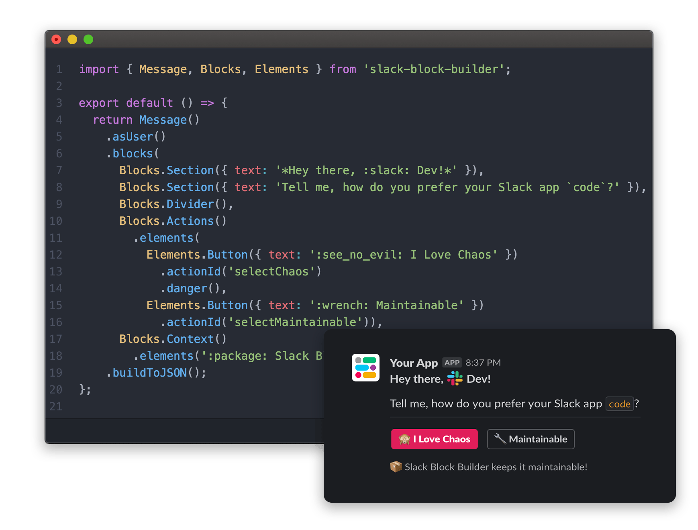
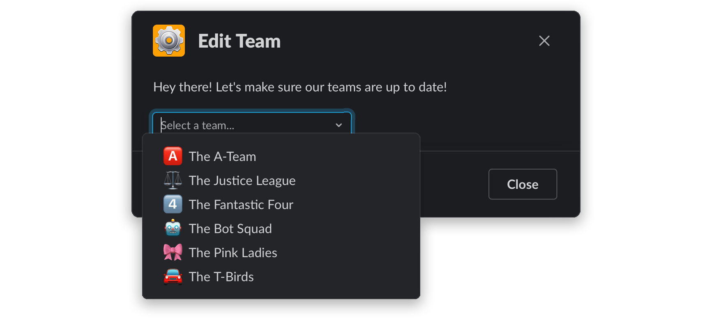
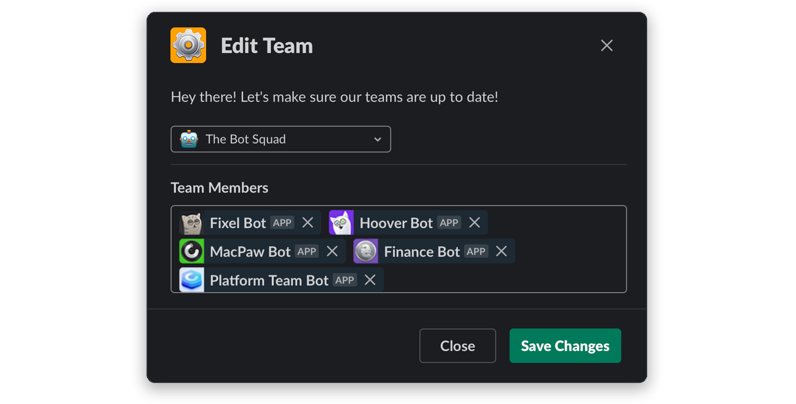

<p align="center">
    
</p>

<p align="center">
    <h3 align="center">Maintainable code for Slack interactive messages, modals, and home tabs.</h3>
</p>

<p align="center">
    Lightweight, zero-dependency JavasScript library for Slack UI.
    <br />
    <br />
    <a href="#real-world-examples"><strong>View Real-World Examples »</strong></a>
    <br />
    <br />
    <a href="#space_invader--usage">Quick Start Guide</a>
    ·
    <a href="https://github.com/raycharius/slack-block-builder/issues">Request Feature</a>
    ·
    <a href="https://github.com/raycharius/slack-block-builder/issues">Report Bug</a>
  </p>
</p>



***
  
[](https://www.npmjs.com/package/slack-block-builder)

[](https://codecov.io/gh/raycharius/slack-block-builder)
[](https://codeclimate.com/github/raycharius/slack-block-builder/maintainability)


**Block Builder** helps you keep your Slack app code for UI maintainable, testable, and reusable. It has a simple builder syntax inspired by [SwiftUI](https://developer.apple.com/documentation/swiftui) and lets you code the _you_ want to code.


## :zap: &nbsp; Features

* Simple [SwiftUI](https://developer.apple.com/xcode/swiftui/)-inspired syntax.
* Builder syntax for better visual code structure.
* Constructor interface that can be used together with the builder interface for maximum flexibility.
* Support for all current Slack Block Kit objects – Surfaces, Blocks, Elements, and Composition Objects ([View Support](#object-support-and-reference)).
* Super helpful JSDoc hints that include real-world explanations, Slack validation rules, and a direct link to the object's documentation on [Slack's API doc site](https://api.slack.com/block-kit).
* Output of the composed UI as either an object or JSON.
* A `printPreviewURL()` method that outputs to the console a link to preview your UI on Slack's [Block Kit Builder website](https://app.slack.com/block-kit-builder).
* Small size, with zero dependencies.

#### :hammer: &nbsp; Coming Soon

* In-depth doc site.
* TypeScript type definitions.
* Components, such as an Accordion module.
* Configurable option to check [Slack](https://slack.com) validation rules.
* Guide for [Slack](https://slack.com) apps with tips, tricks, and best practices.


## :gift: &nbsp; Benefits

* Write three times less code.
* Build more sophistocated, elegant flows.
* Design better UI architecture (works as a template engine).
* Focus more on experience and code in your IDE than on reading [Slack API docs](https://api.slack.com/).
* Code the way you want to code – [not forced into any single paradigm](#advanced-use-cases).
* Easily integrate localizations into your app.

## :floppy_disk: &nbsp; Installation 

#### Using NPM: 

``` bash
npm install --save slack-block-builder
```

#### Using Yarn: 

``` bash
yarn add slack-block-builder
```

## :space_invader: &nbsp; Usage

* [**Importing**](#importing)
* [**Exposed Objects**](#exposed-objects)
* [**Object Support and Reference**](#object-support-and-reference)
* [**Heirarchy/Structure**](#heirarchystructure)
* [**Creating a Simple Interactive Message**](#creating-a-simple-interactive-message)
* [**Creating a Simple Modal**](#creating-a-simple-modal)
* [**About The Builder Methods**](#about-the-builder-methods)
* [**Output**](#output)
* [**Advanced Use Cases**](#advanced-use-cases)
  - [**Using Conditionals**](#using-conditionals)

### Importing

At the top level of the library, there are a few objects exposed for import. You'll be using these to build out your UI: 

```javascript
import { Message, Blocks, Elements, Bits } from 'slack-block-builder';
```

You can also import, in place of `Message`, `Modal` or `HomeTab`.

### Exposed Objects

`Modal` – Used to create a modal surface.

`Message` – Used to create a message surface.

`HomeTab` – Used to create a message surface.

_Note that since you'll more often only be working with one surface per file, they are exposed individually, whereas the rest of the objects are grouped into categories._

`Blocks` – Layout blocks used to organize the UI.

`Elements` – UI elements that are used to capture user interaction.

`Bits` – These are composition objects from Slack's docs that are more focused on UI, not data structure (unlike text and filter objects). Included are `Options`, `OptionGroup`, and `ConfirmationDialog`. They felt like they were deserving of their own category.

### Object Support and Reference

Below is a list of supported objects and how to access them in **Block Builder**:

| **Type**             | **Name**           | **Support**    | **Access Via**  
|----------------------|--------------------|----------------|----------------
| Surface              | Message            | ✅             | `Message()`
| Surface              | Modal              | ✅             | `Modal()`
| Surface              | App Home           | ✅             | `AppHome()`
| Block                | Actions            | ✅             | `Blocks.Actions()`
| Block                | Context            | ✅             | `Blocks.Context()`
| Block                | Divider            | ✅             | `Blocks.Divider()`
| Block                | File               | ✅             | `Blocks.File()`
| Block                | Image              | ✅             | `Blocks.Image()`
| Block                | Input              | ✅             | `Blocks.Input()`
| Block                | Section            | ✅             | `Blocks.Section()`
| Element              | Button             | ✅️             | `Elements.Button()`
| Element              | Checkboxes         | ✅             | `Elements.Checkboxes()`
| Element              | Date Picker        | ✅             | `Elements.DatePicker()`
| Element              | Image              | ✅             | `Elements.Img()`
| Element              | Overflow Menu      | ✅             | `Elements.OverflowMenu()`
| Element              | Radio Buttons      | ✅             | `Elements.RadioButtons()`
| Element              | Plain Text Input   | ✅             | `Elements.TextInput()`
| Element              | Select Menus       | ✅             | `Elements.[Type]Select()`
| Element              | Multi-Select Menus | ✅             | `Elements.[Type]MultiSelect()`
| Composition Object   | Option             | ✅             | `Bits.Option()`
| Composition Object   | Confirm Dialog     | ✅             | `Bits.ConfirmationDialog()`
| Composition Object   | Option Group       | ✅             | `Bits.OptionGroup()`
| Composition Object   | Text Object        | ✅             | Built in Background (Both Plain and Markdown)
| Composition Object   | Filter Object      | ✅             | Built in Background

### Heirarchy/Structure

When building views, there'a certain heirarchy that needs to be followed, which is true to any library that works with [Slack](https://slack.com) Blocks: 

_***Surfaces => Contain Blocks***_ – Think of these as the `<body>` HTML tag. 

_***Blocks => Contain Elements***_ – Think of these as the `<section>` or `<div>` HTML tags.

_***Elements => Contain Bits***_ – More often than not, `Elements` are various types of input controls.

Bits are small pieces of the UI. Such as an `Option` for a select menu. However, the `ConfirmationDialog` Bit can be present in multiple areas of the UI, not just in `Elements`.

### Creating a Simple Interactive Message

Let's take a look at how to compose an interactive message. Even though [Slack](https://slack.com) now has modals, these have always been the basis for [Slack](https://slack.com) apps.

We can create a piece of UI using only the builder methods: 

```javascript
import { Message, Blocks, Elements } from 'slack-block-builder';

const myMessage = ({ channel }) => {
  return Message()
    .channel(channel)
    .text('Alas, my friend.')
    .blocks(
      Blocks.Section()
        .text('One does not simply walk into Slack and click a button.'),
      Blocks.Section()
        .text('At least that\'s what my friend Slackomir said :crossed_swords:'),
      Blocks.Divider(),
      Blocks.Actions()
        .elements(
          Elements.Button()
            .text('Sure One Does')
            .actionId('gotClicked')
            .danger(),
          Elements.Button()
            .text('One Does Not')
            .actionId('scaredyCat')
            .primary()))
    .asUser()
    .buildToJSON();
};
```
Alternatively (and preferably), we can combine both the builder methods and the constructors to shorten it:

```javascript
import { Message, Blocks, Elements } from 'slack-block-builder';

const myShorterMessage = ({ channel }) => {
  return Message({ channel, text: 'Alas, my friend.' })
    .blocks(
      Blocks.Section({ text: 'One does not simply walk into Slack and click a button.' }),
      Blocks.Section({ text: 'At least that\'s what my friend Slackomir said :crossed_swords:' }),
      Blocks.Divider(),
      Blocks.Actions()
        .elements(
          Elements.Button({ text: 'Sure One Does', actionId: 'gotClicked' })
            .danger(),
          Elements.Button({ text: 'One Does Not', actionId: 'scaredyCat' })
            .primary()))
    .asUser()
    .buildToJSON();
};
```

Both of these examples render the message below. And the best part? It only took 15 lines of code, as opposed to the 44 lines of JSON generated as a result. 


[**View Example on Slack Block Kit Builder Website**](https://app.slack.com/block-kit-builder#%7B%22blocks%22:%5B%7B%22type%22:%22section%22,%22text%22:%7B%22type%22:%22mrkdwn%22,%22text%22:%22One%20does%20not%20simply%20walk%20into%20Slack%20and%20click%20a%20button.%22%7D%7D,%7B%22type%22:%22section%22,%22text%22:%7B%22type%22:%22mrkdwn%22,%22text%22:%22At%20least%20that's%20what%20my%20friend%20Slackomir%20said%20:crossed_swords:%22%7D%7D,%7B%22type%22:%22divider%22%7D,%7B%22type%22:%22actions%22,%22elements%22:%5B%7B%22type%22:%22button%22,%22text%22:%7B%22type%22:%22plain_text%22,%22text%22:%22Sure%20One%20Does%22%7D,%22action_id%22:%22gotClicked%22,%22style%22:%22danger%22%7D,%7B%22type%22:%22button%22,%22text%22:%7B%22type%22:%22plain_text%22,%22text%22:%22One%20Does%20Not%22%7D,%22action_id%22:%22scaredyCat%22,%22style%22:%22primary%22%7D%5D%7D%5D%7D)

If you look up at the example again, you can see there is more going on than just building out UI. 

In this function, we are also defining the channel to which the message is sent, and also invoking the `asUser()` method. The `Message` and `Modal` objects in **Block Builder** both include similar methods. 

If you've been working with the [Slack API](https://api.slack.com/) for a while, you know about these options already. More on that coming with the full documentation. In the meantime, check out the IDE hints and the rest of this README.

However, you'll definitely want to take a look at the [Output](#output) section to get an idea of the methods used to get the final output.

### Creating a Simple Modal

Let's take a look at how modals are created. 

In this part, we'll also take a look at working with Bits. You'll see in this example that we're hardcoding the options in the select menu. There are, of course, better ways to handle that. That will be covered a bit later in the [About The Builder Methods](#about-the-builder-methods) section.

First, an example using just our builder methods:

```javascript
import { Modal, Blocks, Elements, Bits } from 'slack-block-builder';

const myModal = () => {
  return Modal()
    .title('PizzaMate')
    .blocks(
      Blocks.Section()
        .text('Hey there, colleague!'),
      Blocks.Section()
        .text('Hurray for corporate pizza! Let\'s get you fed and happy :pizza:'),
      Blocks.Input()
        .label('What can we call you?')
        .element(
          Elements.TextInput()
            .placeholder('Hi, my name is... (What?!) (Who?!)')
            .actionId('name')),
      Blocks.Input()
        .label('Which floor are you on?')
        .element(
          Elements.TextInput()
            .placeholder('HQ – Fifth Floor')
            .actionId('floor')),
      Blocks.Input()
        .label('What\'ll you have?')
        .element(
          Elements.StaticSelect()
            .placeholder('Choose your favorite...')
            .actionId('item')
            .options(
              Bits.Option().text(':cheese_wedge: With Cheeze').value('012'),
              Bits.Option().text(':fish: With Anchovies').value('013'),
              Bits.Option().text(':cookie: With Scooby Snacks').value('014'),
              Bits.Option().text(':beer: I Prefer Steak and Beer').value('015'))))
    .submit('Get Fed')
    .buildToJSON();
};
```

Alternatively (and preferably), we can combine both the builder methods and the constructors to shorten it:

```javascript
import { Modal, Blocks, Elements, Bits } from 'slack-block-builder';

const myShorterModal = () => {
  return Modal({ title: 'PizzaMate', submit: 'Get Fed' })
    .blocks(
      Blocks.Section({ text: 'Hey there, colleague!' }),
      Blocks.Section({ text: 'Hurray for corporate pizza! Let\'s get you fed and happy :pizza:' }),
      Blocks.Input({ label: 'What can we call you?' })
        .element(
          Elements.TextInput({ placeholder: 'Hi, my name is... (What?!) (Who?!)' })
            .actionId('name')),
      Blocks.Input({ label: 'Which floor are you on?' })
        .element(
          Elements.TextInput({ placeholder: 'HQ – Fifth Floor' })
            .actionId('floor')),
      Blocks.Input({ label: 'What\'ll you have?' })
        .element(
          Elements.StaticSelect({ placeholder: 'Choose your favorite...' })
            .actionId('item')
            .options(
              Bits.Option({ text: ':cheese_wedge: With Cheeze', value: '012' }),
              Bits.Option({ text: ':fish: With Anchovies', value: '013' }),
              Bits.Option({ text: ':cookie: With Scooby Snacks', value: '014' }),
              Bits.Option({ text: ':beer: I Prefer Steak and Beer', value: '015' }))))
    .buildToJSON();
};
```

Both of these examples render the modal below. 


[**View Example on Slack Block Kit Builder Website**](https://app.slack.com/block-kit-builder#%7B%22type%22:%22modal%22,%22title%22:%7B%22type%22:%22plain_text%22,%22text%22:%22PizzaMate%22%7D,%22blocks%22:%5B%7B%22type%22:%22section%22,%22text%22:%7B%22type%22:%22mrkdwn%22,%22text%22:%22Hey%20there,%20colleague!%22%7D%7D,%7B%22type%22:%22section%22,%22text%22:%7B%22type%22:%22mrkdwn%22,%22text%22:%22Hurray%20for%20corporate%20pizza!%20Let's%20get%20you%20fed%20and%20happy%20:pizza:%22%7D%7D,%7B%22type%22:%22input%22,%22label%22:%7B%22type%22:%22plain_text%22,%22text%22:%22What%20can%20we%20call%20you?%22%7D,%22element%22:%7B%22type%22:%22plain_text_input%22,%22action_id%22:%22name%22,%22placeholder%22:%7B%22type%22:%22plain_text%22,%22text%22:%22Hi,%20my%20name%20is...%20(What?!)%20(Who?!)%22%7D%7D%7D,%7B%22type%22:%22input%22,%22label%22:%7B%22type%22:%22plain_text%22,%22text%22:%22Which%20floor%20are%20you%20on?%22%7D,%22element%22:%7B%22type%22:%22plain_text_input%22,%22action_id%22:%22floor%22,%22placeholder%22:%7B%22type%22:%22plain_text%22,%22text%22:%22HQ%20–%20Fifth%20Floor%22%7D%7D%7D,%7B%22type%22:%22input%22,%22label%22:%7B%22type%22:%22plain_text%22,%22text%22:%22What'll%20you%20have?%22%7D,%22element%22:%7B%22type%22:%22static_select%22,%22placeholder%22:%7B%22type%22:%22plain_text%22,%22text%22:%22Choose%20your%20favorite...%22%7D,%22action_id%22:%22item%22,%22options%22:%5B%7B%22text%22:%7B%22type%22:%22plain_text%22,%22text%22:%22:cheese_wedge:%20With%20Cheeze%22%7D,%22value%22:%22012%22%7D,%7B%22text%22:%7B%22type%22:%22plain_text%22,%22text%22:%22:fish:%20With%20Anchovies%22%7D,%22value%22:%22013%22%7D,%7B%22text%22:%7B%22type%22:%22plain_text%22,%22text%22:%22:cookie:%20With%20Scooby%20Snacks%22%7D,%22value%22:%22014%22%7D,%7B%22text%22:%7B%22type%22:%22plain_text%22,%22text%22:%22:beer:%20I%20Prefer%20Steak%20and%20Beer%22%7D,%22value%22:%22015%22%7D%5D%7D%7D%5D,%22submit%22:%7B%22type%22:%22plain_text%22,%22text%22:%22Get%20Fed%22%7D%7D)

Similar to the `Message` object, the `Modal` object also supports non UI-related options, such as `notifyOnClose()` or `clearOnClose()`. But those will be covered in the full documentation.

However, you'll definitely want to take a look at the [Output](#output) section to get an idea of the methods used to get the final output.

The above examples should give you a general idea of how to use **Block Builder**, so we'll skip creating a `HomeTab` object, as it almost identical to building out a [Slack](https://slack.com) modal.

### About The Builder Methods

Using the builder methods is super straightforward, but there are a few things that you should know and consider before starting.

#### All Builder Methods Accept `undefined`

If you pass an argument that is `undefined`, you will not get an error. Instead, the property will simply not be set. And **it's a feature**, not a bug. 

To learn more as to why that is, see the [Advanced Use Cases](#advanced-use-cases) section.

#### Some Methods Set, Some Append

Certain builder methods set a single value, whereas others append a new value to an array of existing values. 

As a general rule – methods that end in an 's' will append. A few examples are `Modal.blocks()`, `Blocks.Actions.elements()`, and  `Elements.StaticSelect.options()`.

And as such...

Methods that *set* can only be called once.

```javascript

const myModal = () => {
  return Modal()
    .title('My Modal')  // Sets the title of the modal
    .blocks( /* Imagine Blocks */ )
    .title('My Modal')  // Will throw an error, as it has already been set through the 'title()' method
    .buildToJSON();
};
```

This also applies to properties that have been set in the constructor.

```javascript
const myOtherModal = () => {
  return Modal({ title: 'My Other Modal' })
    .title('My Modal')  // Will throw an error, as it has already been set through the constructor
    .blocks( /* Imagine blocks */ )
    .buildToJSON();
};
```

Methods that _append_ can be called multiple times.

```javascript
const myModal = () => {
  return Modal({ title: 'My Other Modal' })
    .blocks( /* Add some block */ )
    .blocks( /* Add another */ ) // Does not throw error, simply appends the Block object
    .buildToJSON();
};
```

#### Methods That Append Accept Arrays and Multiple Args

When using a method that appends a value, or a set of values, you can pass in: 

* A single argument.
* Multiple arguments.
* An array.

This way, you can code however you want, withought being forced into a certain paradigm by **Block Builder**.

All three of the following examples produce the exact same result:

```javascript
// Passing a single argument

const myModal = () => {
  return Modal({ title: 'Single Arg Example' })
    .blocks(
      Blocks.Section({ text: 'This is the first section.' }))
    .blocks(
      Blocks.Section({ text: 'This is the second section.' }))
    .blocks(
      Blocks.Section({ text: 'This is the third section.' }))
    .buildToJSON();
};
```

```javascript
// Passing multiple arguments

const myModal = () => {
  return Modal({ title: 'Multiple Args Example' })
    .blocks(
      Blocks.Section({ text: 'This is the first section.' }))
    .blocks(
      Blocks.Section({ text: 'This is the second section.' }),
      Blocks.Section({ text: 'This is the third section.' }))
    .buildToJSON();
};
```

```javascript
// Passing an array

const myModal = () => {
  return Modal({ title: 'Multiple Args Example' })
    .blocks(
      Blocks.Section({ text: 'This is the first section.' }))
    .blocks([
      Blocks.Section({ text: 'This is the second section.' }),
      Blocks.Section({ text: 'This is the third section.' }),
    ])
    .buildToJSON();
};
```

This also allows you to use helpful functions such as `Array.map()`, `Array.reduce()`, etc.

Returning to our modal example from above, we can use this to programmatically create the list of options: 

```javascript
const myShorterModal = ({ menu }) => { // Pass in an array of menu items from data source
  return Modal({ title: 'PizzaMate', submit: 'Get Fed' })
    .blocks(
      Blocks.Section({ text: 'Hey there, colleague!' }),
      Blocks.Section({ text: 'Hurray for corporate pizza! Let\'s get you fed and happy :pizza:' }),
      Blocks.Input({ label: 'What can we call you?' })
        .element(
          Elements.TextInput({ placeholder: 'Hi, my name is... (What?!) (Who?!)' })
            .actionId('name')),
      Blocks.Input({ label: 'Which floor are you on?' })
        .element(
          Elements.TextInput({ placeholder: 'HQ – Fifth Floor' })
            .actionId('floor')),
      Blocks.Input({ label: 'What\'ll you have?' })
        .element(
          Elements.StaticSelect({ placeholder: 'Choose your favorite...' })
            .actionId('item')
            .options(menu.map((item) => Bits.Option({ text: item.name, value: item.id }))))) // Map items to Option objects
    .buildToJSON();
};
```

### Output

There are a few different methods that can be called on surfaces (`Message`, `Modal`, `HomeTab`) to get various types of output:

```javascript
Message.buildToJSON()
Modal.buildToJSON()
HomeTab.buildToJSON()
```
Returns a JSON (string) representation of the UI, compatible with the [Slack API](https://api.slack.com/).

```javascript
Message.buildToObject()
Modal.buildToObject()
HomeTab.buildToObject()
```

Returns an object representation of the UI, compatible with the [Slack API](https://api.slack.com/) (once stringified).

```javascript
Message.printPreviewUrl()
Modal.printPreviewUrl()
HomeTab.printPreviewUrl()
```

Logs a preview URL to Slack's [Block Kit Builder website](https://app.slack.com/block-kit-builder) to the console.

```javascript
Message.getBlocks()
```

Returns an array of `Block` objects attached to the `Message` object. Use this if you wish to move all message configuration to another area of your application.

Note that only one method can be called on the object, and needs to be called after all of the necessary properties have been set.

### Advanced Use Cases

#### Using Conditionals

There are multiple ways to handle conditionals with **Block Builder**. This is where **Block Builder** provides the most flexibility, since the builder methods, when receiving an argument that is `undefined`, simply do not set the property. 

While you can definitely use traditional `if` statements, you can also pass in potentially undefined values, inline ternary expressions, the `&&` operator, or even self-invoking functions. Below there is a [real-world example](#conditionals-real-world-example), but let's first take a look at the basics:

```javascript
import { Modal, Blocks, Elements, Bits } from 'slack-block-builder';

const someModal = ({ someData }) => {
  return Modal({ title: 'Using If Statements' })
    .blocks(
      Blocks.Section({ text: 'Let\'s take a look at conditionals.' }),
      Blocks.Section({ text: 'This is a much better way to do it!' }))
    .blocks(someData && [
      Blocks.Section({ text: 'This is added if condition is true.' }),
      Blocks.Section({ text: 'And it\'s super easy and readable!' }),
    ])
    .submit(someData ? 'Is Is True' : 'It Is False')
    .buildToJSON();
};
```

As you can see, doing this helps keep the view-like structure of the file, while taking full advantage of conditionals. 

However, you can definitely use traditional `if` statements: 

```javascript
import { Modal, Blocks, Elements, Bits } from 'slack-block-builder';

const someModal = ({ someData }) => {
  const view = Modal({ title: 'Using If Statements' })
    .blocks(
      Blocks.Section({ text: 'Let\'s take a look at using an if statement.' }),
      Blocks.Section({ text: 'It\'s actually quite simple.' }))
  
  if (someData) {
    view.blocks( /* Append Blocks */ );
  }
  
  if (someData) {
    view.submit('It Is True');
  } else {
    view.submit('It Is False');
  }

  return view.buildToJSON();
};
```

When it comes to appending blocks or changing content for a surface, this is perfectly fine. But the code becomes _much less declarative_ once those conditions start to apply to nested objects, as you'll end up moving code to the top of the function:

```javascript
import { Modal, Blocks, Elements, Bits } from 'slack-block-builder';

const someModal = ({ someData }) => {
  const someBlock = Blocks.Section()
  
  someData 
    ? someBlock.text('Can get unintuitive with nested objects.')
    : someBlock.text('But there is a much better way!')
  
  const view = Modal({ title: 'Using If Statements' })
    .blocks(
      Blocks.Section({ text: 'Let\'s take a look at using an if statement.' }),
      someBlock,
    )
  
  if (someData) {
    view.blocks( /* Append Blocks */ );
  }
  
  if (someData) {
    view.submit('It Is True');
  } else {
    view.submit('It Is False');
  }

  return view.buildToJSON();
};
```

## Real-World Examples

### Conditionals

Let's say you have an app that manages team rosters, through a [Slack](https://slack.com) modal. 

When it opens, it greets the user and presents them with a select menu of teams: 



[**View Example on Slack Block Kit Builder Website**](https://app.slack.com/block-kit-builder/#%7B%22type%22:%22modal%22,%22title%22:%7B%22type%22:%22plain_text%22,%22text%22:%22Edit%20Team%22%7D,%22blocks%22:%5B%7B%22type%22:%22section%22,%22text%22:%7B%22type%22:%22mrkdwn%22,%22text%22:%22Hey%20there%21%20Let%27s%20make%20sure%20our%20teams%20are%20up%20to%20date%21%22%7D%7D,%7B%22type%22:%22actions%22,%22elements%22:%5B%7B%22type%22:%22static_select%22,%22placeholder%22:%7B%22type%22:%22plain_text%22,%22text%22:%22Select%20a%20team...%22%7D,%22action_id%22:%22team%22,%22options%22:%5B%7B%22text%22:%7B%22type%22:%22plain_text%22,%22text%22:%22:a:%20%20The%20A-Team%22%7D,%22value%22:%221%22%7D,%7B%22text%22:%7B%22type%22:%22plain_text%22,%22text%22:%22:scales:%20%20The%20Justice%20League%22%7D,%22value%22:%222%22%7D,%7B%22text%22:%7B%22type%22:%22plain_text%22,%22text%22:%22:four:%20%20The%20Fantastic%20Four%22%7D,%22value%22:%223%22%7D,%7B%22text%22:%7B%22type%22:%22plain_text%22,%22text%22:%22:robot_face:%20%20The%20Bot%20Squad%22%7D,%22value%22:%224%22%7D,%7B%22text%22:%7B%22type%22:%22plain_text%22,%22text%22:%22:ribbon:%20%20The%20Pink%20Ladies%22%7D,%22value%22:%225%22%7D,%7B%22text%22:%7B%22type%22:%22plain_text%22,%22text%22:%22:oncoming_automobile:%20%20The%20T-Birds%22%7D,%22value%22:%226%22%7D%5D%7D%5D%7D%5D,%22callback_id%22:%22editTeam%22%7D)

When the user selects a team from the menu, a multiselect is appended to the modal, prepopulated with all of the team's members. In addition, the `Save Changes` button appears: 



[**View Example on Slack Block Kit Builder Website**](https://app.slack.com/block-kit-builder/#%7B%22type%22:%22modal%22,%22title%22:%7B%22type%22:%22plain_text%22,%22text%22:%22Edit%20Team%22%7D,%22blocks%22:%5B%7B%22type%22:%22section%22,%22text%22:%7B%22type%22:%22mrkdwn%22,%22text%22:%22Hey%20there%21%20Let%27s%20make%20sure%20our%20teams%20are%20up%20to%20date%21%22%7D%7D,%7B%22type%22:%22actions%22,%22elements%22:%5B%7B%22type%22:%22static_select%22,%22placeholder%22:%7B%22type%22:%22plain_text%22,%22text%22:%22Select%20a%20team...%22%7D,%22action_id%22:%22team%22,%22options%22:%5B%7B%22text%22:%7B%22type%22:%22plain_text%22,%22text%22:%22:a:%20%20The%20A-Team%22%7D,%22value%22:%221%22%7D,%7B%22text%22:%7B%22type%22:%22plain_text%22,%22text%22:%22:scales:%20%20The%20Justice%20League%22%7D,%22value%22:%222%22%7D,%7B%22text%22:%7B%22type%22:%22plain_text%22,%22text%22:%22:four:%20%20The%20Fantastic%20Four%22%7D,%22value%22:%223%22%7D,%7B%22text%22:%7B%22type%22:%22plain_text%22,%22text%22:%22:robot_face:%20%20The%20Bot%20Squad%22%7D,%22value%22:%224%22%7D,%7B%22text%22:%7B%22type%22:%22plain_text%22,%22text%22:%22:ribbon:%20%20The%20Pink%20Ladies%22%7D,%22value%22:%225%22%7D,%7B%22text%22:%7B%22type%22:%22plain_text%22,%22text%22:%22:oncoming_automobile:%20%20The%20T-Birds%22%7D,%22value%22:%226%22%7D%5D,%22initial_option%22:%7B%22text%22:%7B%22type%22:%22plain_text%22,%22text%22:%22:robot_face:%20%20The%20Bot%20Squad%22%7D,%22value%22:%224%22%7D%7D%5D%7D,%7B%22type%22:%22divider%22%7D,%7B%22type%22:%22input%22,%22label%22:%7B%22type%22:%22plain_text%22,%22text%22:%22Team%20Members%22%7D,%22element%22:%7B%22type%22:%22multi_users_select%22,%22placeholder%22:%7B%22type%22:%22plain_text%22,%22text%22:%22Please%20add%20members...%22%7D,%22action_id%22:%22members%22,%22initial_users%22:%5B%22U0142JZHQS1%22,%22U0142K60MJR%22,%22UR7CKBU4W%22,%22USML56H16%22,%22USPPJUL01%22%5D%7D%7D%5D,%22submit%22:%7B%22type%22:%22plain_text%22,%22text%22:%22Save%20Changes%22%7D,%22callback_id%22:%22editTeam%22%7D)

This flow can be called in two different ways: 

* Via a slash command `/teams`
* Via a button called `Edit Bot Squad`in an interactive message sent to one of the members. 

In the first case, you don't know which team the user wants to edit, so the modal should open with no default option in the select menu, and no appended multiselect menu for the members, either.

However, in the second case, you know exactly which team the user wants to edit, so the modal should open up with the selected team and the team's members. We are counting clicks, right?

Let's try it out with some inline conditionals and see how it reads:

```javascript
import { Modal, Blocks, Elements, Bits } from 'slack-block-builder';

const editTeamModal = ({ teams, selectedTeamId, members }) => {
  return Modal({ title: 'Edit Team' })
    .callbackId('editTeam')
    .blocks(
      Blocks.Section({ text: 'Hey there! Let\'s make sure our teams are up to date!' }),
      Blocks.Input({ label: 'Which team do you want to edit?' })
        .element(
          Elements.StaticSelect({ placeholder: 'Select a team...' })
            .actionId('team')
            .options(teams.map((team) => Bits.Option({ text: team.name, value: team.id })))
            .initialOption(selectedTeamId && teams
              .filter((team) => team.id === selectedTeamId) // Only include initial option is team has been chosen
              .map((team) => Bits.Option({ text: team.name, value: team.id }))[0]
            )))
    .blocks(selectedTeamId && [ // Only include multiselect for members if team has been selected
      Blocks.Divider(),
      Blocks.Input({ label: 'Team Members' })
        .element(
          Elements.UserMultiSelect({ placeholder: 'Please add members...' })
            .actionId('members')
            .initialUsers(members && members.map((member) => member.slackId))), // Only include initials members if members are present
    ])
    .submit(selectedTeamId && 'Save Changes') // Only include 'Save Changes' button if form has actually been loaded
    .buildToJSON();
};

```

There are multiple ways to add logic with this in mind. If you're feeling especially adventurous, you could even pass in a self-invoking function with a `switch` block. 

Originally, the idea of accepting a value of `undefined` was to help assist with simple things, such as passing in a value to the `initialOption()` method for select menus, but it opens the door for a lot manipulation. It's up to you to decide where you draw the line with this type of inline logic.

## :link: :&nbsp; Other Useful Slack-Related Projects

[Bolt for Javascript](https://github.com/SlackAPI/bolt) – A simple framework for building [Slack](https://slack.com) apps, developed by [Slack](https://slack.com) themselves.

[Node Slack SDK](https://github.com/slackapi/node-slack-sdk) – A great and powerful SDK for building [Slack](https://slack.com) Apps from the ground up.

## :fire: &nbsp; Acknowledgements
 
 Taras Neporozhniy ([@bravecow](https://github.com/bravecow)) - For All of the Advice

 Alexey Chernyshov ([@ft502](https://dribbble.com/ft502) on Dribbble) - For the Wonderful Logo

 SlackHQ ([@slackhq](https://github.com/slackhq)) - For the Wonderful Product and API

## :black_nib: &nbsp; Author

 Ray East ([@raycharius](https://github.com/raycharius)) - Huge Fan of Slack and Block Builder Maintainer
e
