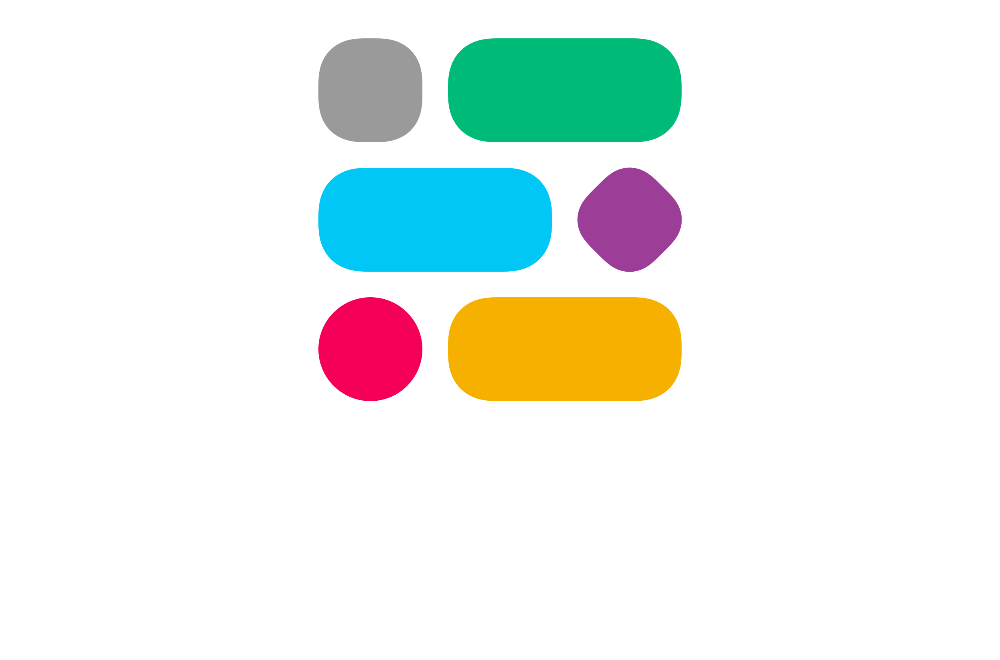

    <h3 align="center">Welcome to the docs site for Block Builder.</h3>

    Your Slack apps are about to get a lot more <em>maintainable</em>.

[View Docs](#start)
[Go to GitHub](https://github.com/raycharius/slack-block-builder/)

