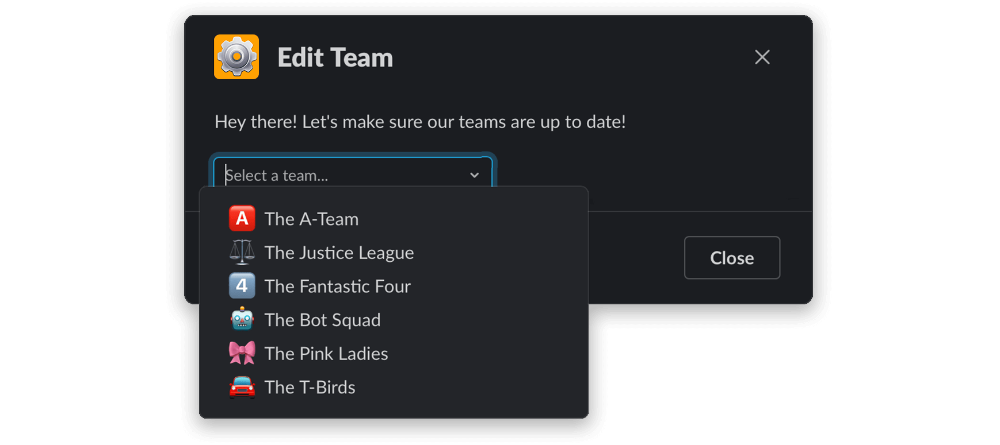
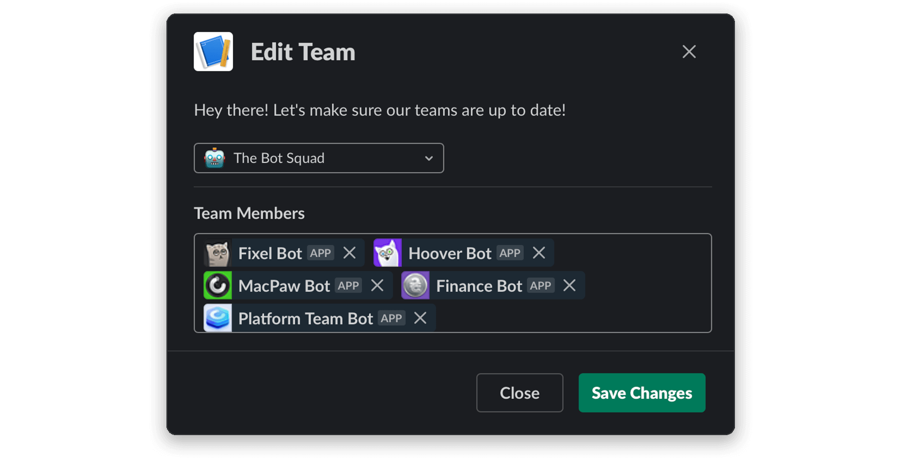

# Case Studies

Here you'll find some real work examples that walk you through a certain flow and how they can be handled with **Block Builder**, as well as the topics included from the **General Concepts** section. 

### Team Roster App

**Topics Covered:**

* Creating a modal.
* Using conditions.
* Working with arrays.

**Scenario**

Let's say you have an app that manages team rosters, through a [Slack](https://slack.com) modal. 

When it opens, it greets the user and presents them with a select menu of teams: 



When the user selects a team from the menu, a multiselect is appended to the modal, prepopulated with all of the team's members. In addition, the **Save Changes** button appears: 



This flow can be called in two different ways: 

* Via a slash command `/teams`
* Via a button called **Edit Bot Squad** in an interactive message sent to one of the members. 

In the first case, you don't know which team the user wants to edit, so the modal should open with no default option in the select menu, and no appended multiselect menu for the members, either.

**Let's take a look at how to handle the code for that:**

```javascript
import { Modal, Blocks, Elements, Bits } from 'slack-block-builder';

const editTeamModal = ({ teams, selectedTeamId, members }) => {
  return Modal({ title: 'Edit Team' })
    .callbackId('editTeam')
    .blocks(
      Blocks.Section({ text: 'Hey there! Let\'s make sure our teams are up to date!' }),
      Blocks.Input({ label: 'Which team do you want to edit?' })
        .element(
          Elements.StaticSelect({ placeholder: 'Select a team...' })
            .actionId('team')
            .options(teams.map((team) => Bits.Option({ text: team.name, value: team.id })))
            .initialOption(selectedTeamId && teams
              .filter((team) => team.id === selectedTeamId) 
              .map((team) => Bits.Option({ text: team.name, value: team.id }))[0]
            )))
    .blocks(selectedTeamId && [
      Blocks.Divider(),
      Blocks.Input({ label: 'Team Members' })
        .element(
          Elements.UserMultiSelect({ placeholder: 'Please add members...' })
            .actionId('members')
            .initialUsers(members && members.map((member) => member.slackId))),
    ])
    .submit(selectedTeamId && 'Save Changes')
    .buildToJSON();
};
```

It's that simple. Very little code, and an experience you 

**Here you can see that:**

* We're creating the modal dialog using both the supported parameters at instantiation, as well as the chainable setter methods.
* We're only append the `Block` objects with the actual team roster when we know which team we need to show. Until that moment, we show only the select menu.
* We're also only adding the **Save Changes** button when we know there is a form that can be submitted.  
* We're using `Array.map()` method to dynamically create the `Option` objects for both the team list and the list of users.
* We're building out the view to JSON, and sending that directly in the `view` parameter of either the `views.update` or `views.open` Slack API methods.
